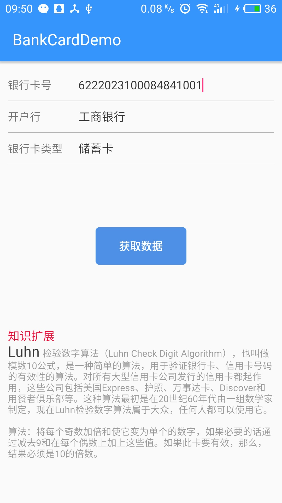
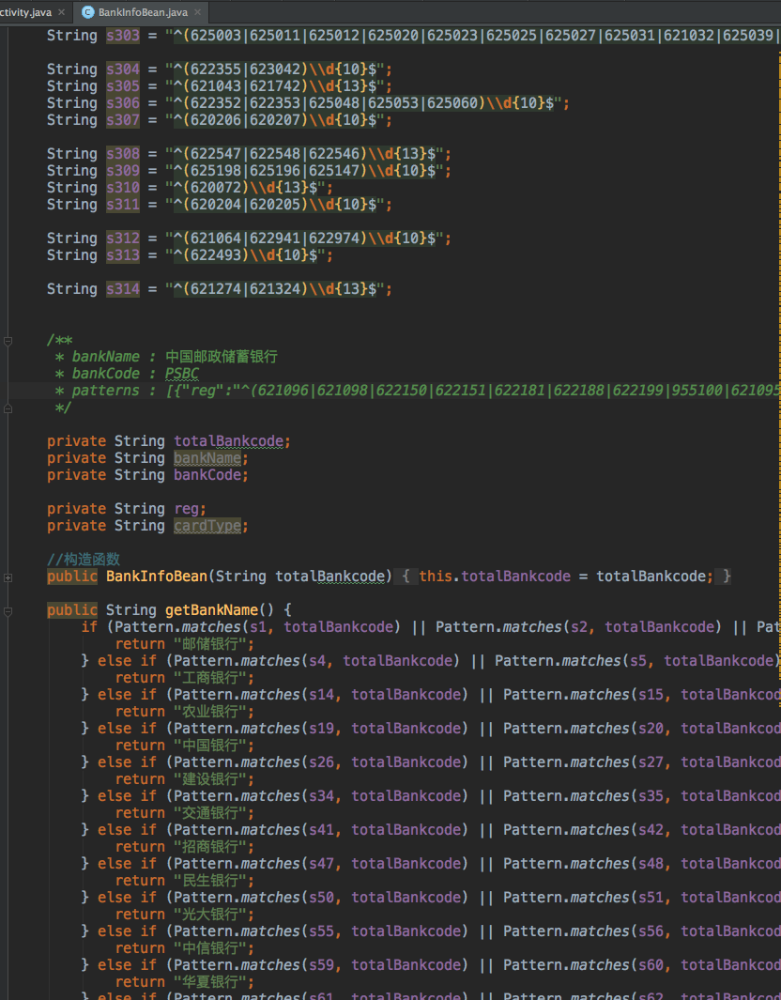

# BankCardDemo

这是关于银行卡匹配信息的demo(根据银行卡号，辅以Luhn算法(也称"模10"算法),精准获取开户行以及银行卡类型等信息)

## 背景
#### 1.由于开发过程中，有关于获取银行卡信息的需求，找了蛮多相关信息，发现千篇一律。

#### 2.有些数据早已过时，而且获取到的数据跟我的需求匹配度较低。

下面是效果图，输入银行卡号，获取银行开户行及银行卡类型

下面是部分核心代码(其实没难度，都是体力劳动)，主要用正则算法做判断

大家用的时候可以直接把BankInfoBean类当作工具类即可，简单明了。

另外assets文件夹下有  识别银行卡的源文件，需要获取银行卡其他信息的朋友或者IOS开发者朋友都可以使用，
我想一定会有所帮助的

如果对你有那么一丝的帮助，请不要吝啬。求star！

If you like this library's design, feel it help to you, you can point the upper right corner "Star" support Thank you! ^ _ ^

